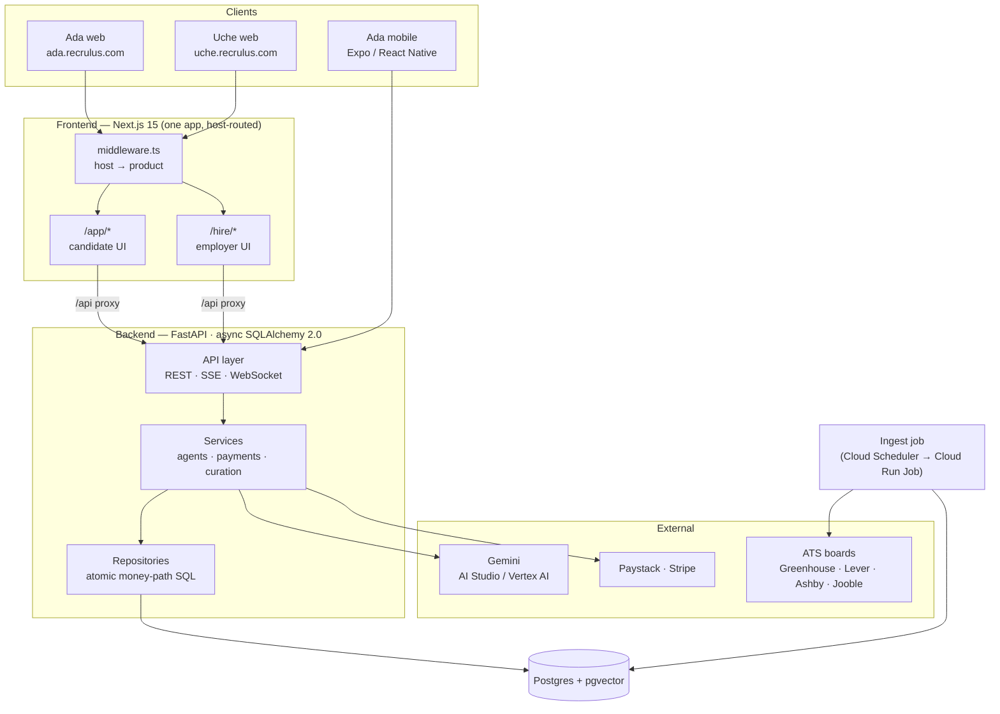
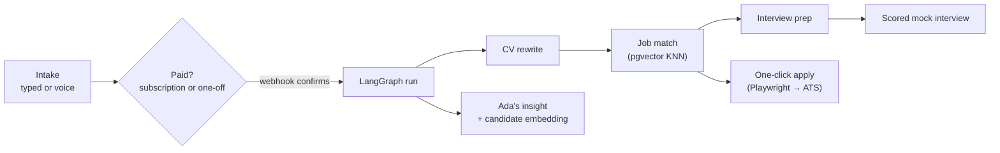
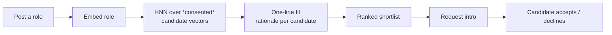

# Ada · Uche — the Recrulus career marketplace

A **two-sided, autonomous career marketplace**. Two AI agents share one backend, one
embedding space, and one payment spine:

- **Ada** — the *candidate's* agent (named for Ada Lovelace). Pay once and she runs the
  whole loop, no human in the workflow: **intake (typed or voice) → ATS CV rewrite →
  job matching → mock interview → scored feedback → one-click apply**. Plus an always-on
  side — accounts, an imported career profile, and **Ask Ada**, a streaming coaching chat.
- **Uche** — the *employer's* agent (named for Grace Hopper's spirit, in an Igbo name to
  match Ada). Post a role once and Uche ranks **consented** candidates by semantic fit,
  explains each in a line, and lets you request an intro.

The defensible seam is the supply: every completed Ada run produces a structured,
role-targeted, embedded candidate — and Uche can only ever see candidates who explicitly
opted in (the consent wall). One person's résumé work becomes the other side's inventory.

```
Ada  gets people hired.        →  ada.recrulus.com   (candidates)
Uche gets roles filled.        →  uche.recrulus.com  (employers)
```

---

## Architecture at a glance



**Stack.** Python 3.11+ · FastAPI · async SQLAlchemy 2.0 · Postgres 16 + pgvector ·
Alembic · LangGraph over Gemini · Paystack + Stripe · Playwright · structlog ·
Next.js 15 (App Router, React 19, Tailwind v4) · Expo / React Native.

---

## The two loops

### Candidate loop (Ada)



A run is money-gated: it only executes after a verified payment (or an active
subscription). Matching reads a **local** `jobs` table that a scheduled ingest job keeps
fresh from real ATS boards — the request path never calls an external job API.

### Employer loop (Uche)



Uche reuses Ada's embedding infrastructure, pointed at candidates instead of jobs, and
**only reads profiles where the candidate turned on “let employers find me.”**

---

## Monorepo

```
backend/    FastAPI service — both agents, payments, auth, ingestion, subscriptions.
            Layered: routes → services → repositories → ORM.       → backend/README.md
frontend/   Next.js 15 app serving BOTH products via host-based routing (Ada at
            /app/*, Uche at /hire/*).                              → frontend/README.md
mobile/     Expo / React Native — the Ada candidate surface (login, runs, pay, voice).
```

CI (`.github/workflows/ci.yml`) is path-filtered: the backend job runs the full quality
gauntlet against a real pgvector Postgres; the frontend job typechecks and builds.

---

## Money-path invariants (the part that must never break)

1. **Signatures prove the sender, not the charge.** Every payment webhook verifies its
   signature, then confirms amount + success **out of band** (Paystack verify API, Stripe
   event fields) before anything executes.
2. **Exactly-once.** The event claim and `PENDING_PAYMENT → PAID` happen in one
   transaction against a `processed_events` ledger; a replayed webhook is a no-op.
3. **No double-run.** Execution takes `PAID → RUNNING` via `UPDATE … WHERE status = PAID`,
   so concurrent workers can't both run a job.
4. **Self-healing.** `python -m ada.recover` re-dispatches runs (and applications) orphaned
   by a lost dispatch — safe to run on a schedule because of (3).

Recurring **subscriptions** (candidate: Pro/Premium; employer: Growth/Scale) flow through
the *same* idempotency ledger in a handler path separate from run dispatch.

---

## Run it locally

```bash
# 1. Infra — Postgres + pgvector
docker compose up -d

# 2. Backend  →  http://localhost:8080
cp backend/.env.example backend/.env      # set GEMINI_API_KEY (AI Studio) or GCP creds
make install                              # backend deps into your env
make migrate && make seed                 # schema + a dev jobs corpus
make dev

# 3. Frontend →  http://localhost:3000  (proxies /api to the backend)
cd frontend && pnpm install && pnpm dev
```

- **AI without GCP:** set `GEMINI_API_KEY` from [Google AI Studio](https://aistudio.google.com/apikey)
  and the whole Gemini stack (runs, insights, curation, chat, voice) runs without Vertex.
- **Local auth needs no email provider** — sign up with any email + password; password-reset
  links are printed to the backend logs.
- **Two products, one dev server:** Ada is `localhost:3000`; Uche is `uche.localhost:3000`
  (the middleware routes the `uche.*` host into `/hire`).

## Verify

```bash
make verify                               # backend gauntlet (see backend/README.md)
cd frontend && pnpm typecheck && pnpm build
```

## Deploy

- **Backend** → Cloud Run (`make deploy`); secrets from Secret Manager; run
  `alembic upgrade head` as a release step; schedule `python -m ada.ingest` as a Cloud Run
  Job and `python -m ada.recover` on a short interval.
- **Frontend** → any Next.js host (e.g. Vercel) with `BACKEND_URL` (server-side proxy
  target) and `NEXT_PUBLIC_WS_URL` (public WebSocket origin).

`backend/src/ada/config.py::validate_runtime` fails the boot in staging/prod unless a
payment provider, `RESEND_API_KEY`, a real `FRONTEND_ORIGIN`, and non-wildcard CORS are set.
