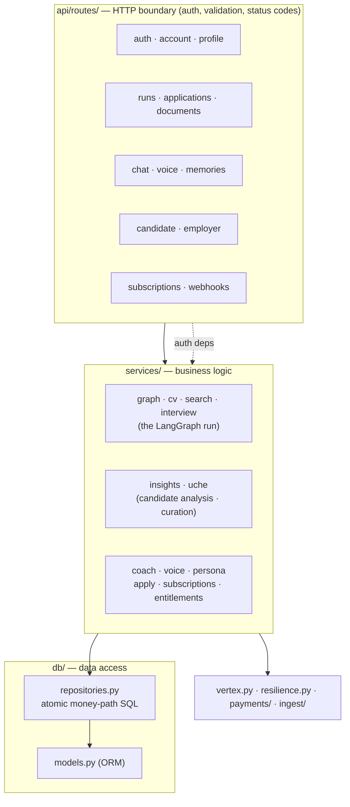
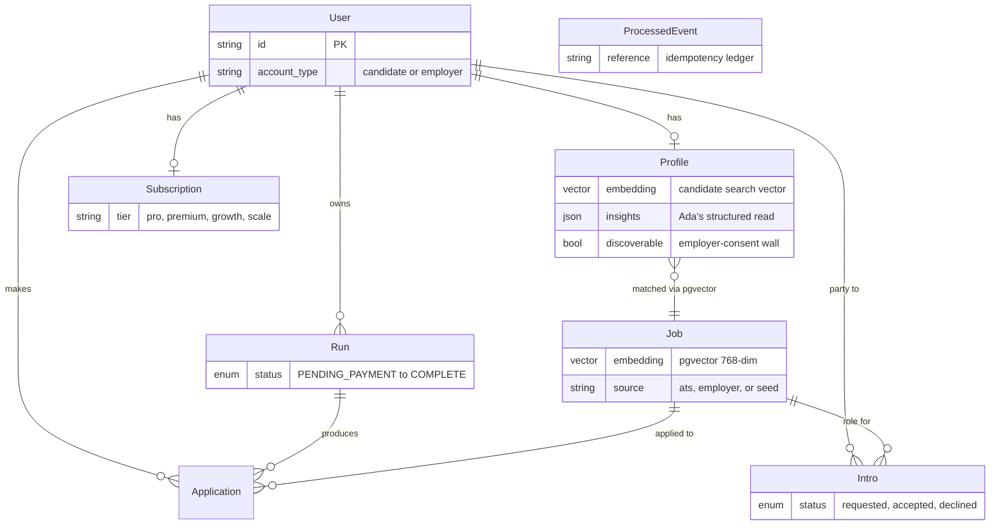
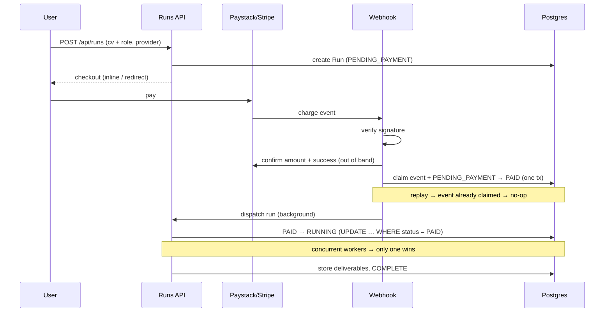

# Ada · Uche — backend

The FastAPI service that runs the entire two-sided marketplace: both agents (Ada for
candidates, Uche for employers), dual-provider payments and subscriptions, email + password
auth, career-profile grounding, job ingestion, and streaming/real-time surfaces (SSE chat,
WebSocket voice).

- **Runtime:** Python 3.11+ · FastAPI · Uvicorn
- **Data:** async SQLAlchemy 2.0 · Postgres 16 + **pgvector** · Alembic (async)
- **AI:** Gemini via **Google AI Studio key** *or* **Vertex AI** (one client, chosen by config) · LangGraph
- **Money:** Paystack (NGN) · Stripe (USD) — one-off runs *and* recurring subscriptions
- **Apply:** Playwright (headless ATS form submission)
- **Ops:** structlog (Cloud Logging-ready) · bounded retries · fail-fast prod config

---

## Layered architecture

Strict one-directional layering — **routes → services → repositories → ORM**. Only
repositories touch the database; the money-path SQL lives there as atomic statements.



### Package map

```
src/ada/
  main.py            app factory — mounts every router under /api; lifespan boot
  config.py          env-driven Settings + validate_runtime() (fail-fast in prod)
  vertex.py          the single Gemini client — AI Studio key OR Vertex, by config
  resilience.py      bounded async retry w/ backoff for transient LLM/API errors
  observability.py   structured JSON logging

  auth/              bcrypt passwords · hashed single-use reset tokens · opaque sessions
                     · Resend mailer · request-scoped deps (current_user / current_employer)
  api/routes/        one module per surface (see Endpoints)
  payments/          paystack + stripe (signature verify, out-of-band charge confirm,
                     checkout, subscription plans) · plans.py catalog
  db/                session (pooled) · models · repositories

  services/
    graph.py         LangGraph: intake → cv_rewrite → job_match → interview_prep
    cv.py            ATS-safe CV rewrite (never invents facts)
    search.py        embeddings + pgvector KNN (candidate↔job matching)
    interview.py     question generation + structured scoring
    insights.py      Ada's structured read of a candidate (+ the search vector)
    uche.py          employer curation — KNN over consented candidates + fit rationale
    coach.py         "Ask Ada" chat, grounded in profile + run history
    persona.py       one shared persona fragment every Gemini call composes with
    voice.py         Gemini Live relay (native audio) — intake + spoken conversation
    apply.py         one-click apply orchestration (deterministic + agentic fallback)
    subscriptions.py provider-webhook → subscription state
    entitlements.py  tier → capability (candidate) and tier → caps (employer)
    runs.py          atomic run execution + crash recovery

  ingest/            ATS adapters (greenhouse/lever/ashby/jooble) + normalize + pipeline
  seed.py            dev-only jobs corpus (embeds at seed time)
  recover.py         re-dispatch runs + applications orphaned by a lost dispatch
migrations/          Alembic 0001…0012 (async)
tests/               unit · DB-gated integration · acceptance (BDD) · HTTP route-layer
```

---

## Data model



Key idea: `Profile` is both the candidate's profile *and*, once they consent, the
search record Uche ranks (`embedding` + `insights`). `Job` is a shared pool — ingested
listings *and* employer postings live together, so employer roles are also matchable for
candidates.

---

## The money path (exactly-once, out-of-band)



**Invariants (enforced in `repositories.py`):**

1. Signature verified → charge confirmed out of band → amount/currency checked against the run.
2. `PaymentRepository.confirm` — event claim + `PENDING_PAYMENT → PAID` in one transaction.
3. `RunRepository.claim_for_execution` — `PAID → RUNNING` atomically.
4. `python -m ada.recover` re-dispatches PAID-but-stuck runs, and sweeps applications stuck
   in `preparing`, safely (because of 2 & 3).

Subscription webhooks (`services/subscriptions.py`) reuse the **same** `processed_events`
ledger in a separate handler path — the run money-path is untouched.

---

## Endpoints

All under `/api`. `current_user` gates candidate routes; `current_employer` additionally
requires `account_type == "employer"`.

### Platform / candidate (Ada)

| Area | Route | Notes |
|---|---|---|
| Health | `GET /healthz` · `GET /readyz` | readyz pings the DB |
| Auth | `POST /auth/signup` · `/auth/login` → cookie; `/auth/request-reset` → `/auth/reset`; `/auth/me`, `/auth/logout` | bcrypt; generic 401 + always-202 reset = no account enumeration; reset tokens hashed, single-use, 30-min TTL |
| Account | `PUT /account` | switch candidate ⇄ employer |
| Profile | `GET/PUT /profile` · `PUT /profile/identity` | grounds chat, runs, insights |
| Runs | `POST /runs` · `GET /runs` · `GET /runs/{id}` · `POST /runs/{id}/interview` | creation works with or without a session; entitlement- or payment-gated |
| Documents | `POST /documents` · `GET /documents` … | CV upload (PDF/DOCX/TXT) → text + GCS archive |
| Apply | `POST /jobs/{id}/apply` · `GET /applications` | Playwright submit; only a detected confirmation = "submitted" |
| Chat | `POST /chat` (SSE) | streams deltas, grounded in profile + runs + memory |
| Voice | `WS /voice` | Gemini Live relay — spoken intake **and** two-way conversation |
| Insights | `GET /candidate/insights` · `PUT /candidate/discoverable` | Ada's analysis + the employer-consent toggle |
| Intros | `GET /candidate/intros` · `POST /candidate/intros/{id}/respond` | accept / decline an employer intro |
| Subscriptions | `GET /plans` · `POST /subscriptions` · `GET /subscription` · `POST /subscriptions/cancel` | Pro / Premium |
| Webhooks | `POST /webhooks/paystack` · `/webhooks/stripe` | the only paths that start a run or move a subscription |

### Employer (Uche) — `account_type == "employer"`

| Route | Notes |
|---|---|
| `POST /employer/jobs` · `GET /employer/jobs` | post a role (joins the shared pool) / list your roles — capped by plan |
| `GET /employer/jobs/{id}/candidates` | Uche's ranked shortlist over **consented** candidates + fit rationale |
| `POST /employer/intros` · `GET /employer/intros` | request an intro (capped by plan) / your outbox |
| `GET /employer/plans` · `GET /employer/plan` | billable tiers (Growth/Scale) + current plan & usage |

---

## AI wiring

`vertex.py` builds **one** Gemini client. If `GEMINI_API_KEY` (Google AI Studio) is set it
uses the Developer API — the whole stack runs with no GCP creds; otherwise it uses Vertex
AI with `GCP_PROJECT`. Every call goes through `resilience.retry_async` (bounded backoff)
and composes the shared `persona.py` fragment, so all surfaces sound like one product.

- **Embeddings** (`search.py`): `text-embedding-004` (Vertex) or `gemini-embedding-001`
  reduced to 768 dims (AI Studio). Cosine distance is scale-invariant, so truncated vectors
  rank consistently — the whole pool just has to use one model.
- **Structured output** (interview scoring, insights, curation rationale) uses response
  schemas so the model returns typed JSON, not prose to parse.
- **Graceful degradation:** if generation is unavailable (no creds / quota), candidate
  analysis falls back to embedding raw profile text — candidates stay discoverable, rankings
  still work, only the written rationale is skipped (logged, never a 500).

---

## Subscriptions & entitlements

Two audiences, one machine (`payments/plans.py` catalog + `services/entitlements.py`):

- **Candidate** — `free` (pay-per-run), `pro`, `premium`. Entitlements gate runs
  (included vs pay-per-run), one-click apply, and live voice.
- **Employer** — `pilot` (free: 1 role, 1 intro), `growth`, `scale` (unlimited). Caps are
  **enforced** at `post_job` and `request_intro` (HTTP `402` with an upgrade message).

Checkout (`POST /subscriptions`) resolves a provider plan/price code per (tier, cadence,
provider); provider webhooks drive the `Subscription` row through active/past-due/canceled.

---

## Fetching jobs (ingestion)

Matching **only ever reads the local `jobs` table** — the request path never calls a job
API. Listings are pulled ahead of time:

```bash
python -m ada.ingest [--limit N]
```

Fetch → normalize → `upsert … ON CONFLICT (source, external_id) DO UPDATE` (re-runs refresh,
never duplicate) → embed rows with NULL vectors. Sources are configured in
`ingest/boards.py`: Greenhouse, Lever, Ashby (public, keyless) and Jooble (Nigeria/global,
keyed via `JOOBLE_FEEDS`). Without model creds the embed pass logs and skips — listings
still land and a later credentialed run backfills vectors.

In production this is a **Cloud Run Job on a Cloud Scheduler trigger**, never a request
handler. `python -m ada.seed` is a dev-only fallback corpus.

## Proactive digest

Ada reaches out on her own — a scheduled sweep that sends each candidate their fresh
best-fit roles across in-app + email + WhatsApp:

```bash
python -m ada.digest
```

For every candidate with a profile vector it KNNs the local jobs pool, and if there are
matches sends a digest — throttled per candidate (`digest_cooldown_seconds`, ~weekly), so
re-runs are no-ops. Another **Cloud Run Job on Cloud Scheduler**; reads the local jobs
table only.

---

## Develop

```bash
pip install -e ".[dev]"           # older macOS: PIP_CONSTRAINT=constraints-local.txt
cp .env.example .env              # set GEMINI_API_KEY (AI Studio) or GCP creds
docker compose up -d              # from repo root — Postgres + pgvector
alembic upgrade head
python -m ada.seed                # dev jobs corpus (needs an embedding-capable key)
uvicorn ada.main:app --reload --port 8080
```

With `APP_ENV=local`, schema auto-creates on boot and password-reset links are logged, not
emailed.

## Test & the quality gauntlet

`make verify` runs the full gauntlet (also enforced in CI):

```
ruff (lint) → mypy (types) → bandit (security) → architecture contracts
→ pytest (unit + DB-gated + BDD acceptance + HTTP route-layer)
→ coverage floor (≥ 45%) → mutation testing (≥ 70% on the money/auth/ingest core)
→ suppression-marker scan (no silent ignores)
```

```bash
ruff check src tests migrations
pytest -q                         # unit
RUN_DB_TESTS=1 pytest -q          # + idempotency/atomicity/route tests against Postgres
make verify                       # the whole gauntlet
```

Test layers: pure unit (services with fakes), DB-gated integration (repositories, atomicity),
BDD acceptance (`features/` — the money path), and HTTP route-layer (`tests/test_routes_http.py`
— auth 401/403, entitlement 402, status codes through the real ASGI app).

## Deploy

Cloud Run via `make deploy` (repo root). Secrets from Secret Manager. Run
`alembic upgrade head` as a release step before shifting traffic. Schedule
`python -m ada.ingest` (Cloud Run Job) and `python -m ada.recover` (short interval).
`validate_runtime()` refuses to boot staging/prod without a payment provider,
`RESEND_API_KEY`, a real `FRONTEND_ORIGIN`, and non-wildcard CORS.
