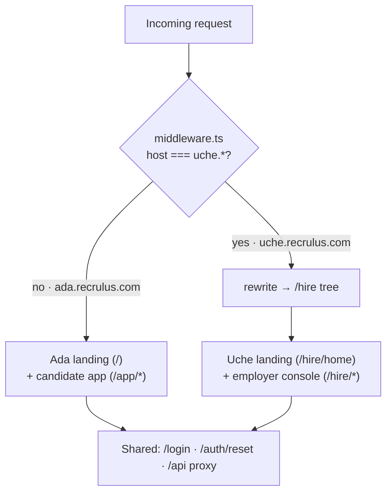

# Ada · Uche — frontend

**One Next.js 15 app serving two products.** Ada (candidates) and Uche (employers) share a
codebase, a design system, and an auth flow; a host-based middleware decides which product a
request sees. Built with the App Router, React 19, TypeScript, and Tailwind v4.

- All `/api/*` calls are proxied to the backend (`next.config.ts` rewrites), so the session
  cookie is **first-party** and CORS never applies.
- The voice page connects straight to the backend **WebSocket** (`NEXT_PUBLIC_WS_URL`) —
  rewrites don't carry protocol upgrades.

---

## Two products, one app



`middleware.ts` rewrites the `uche.*` host into the `/hire` tree while letting
`/login`, `/auth`, `/api`, and assets pass through — auth is one shared flow, only the
branding adapts. Locally: Ada is `localhost:3000`, Uche is `uche.localhost:3000`.

---

## Routes

### Ada — candidate (`/app/*`, behind the app shell)

```
/                          landing: hero + live self-running demo, "Hear from Ada"
                           voice intro, capabilities, how-it-works, pricing, FAQs
/login                     email + password — sign in / sign up / forgot (host-branded)
/auth/reset                set a new password from an emailed reset link
/app                       auth-gated shell → dashboard
/app/new                   intake → Paystack inline / Stripe redirect → live run progress
/app/runs · /app/runs/[id] run history · CV + ranked matches + interview questions
/app/runs/[id]/interview   answer flow → scored feedback
/app/applications          one-click apply status (Ada submits the ATS form)
/app/coach                 Ask Ada — streaming chat grounded in profile + runs
/app/voice                 spoken conversation with Ada (Gemini Live)
/app/documents             every rewritten CV
/app/intros                employers who want to connect — accept / decline
/app/profile               profile + Ada's insight panel + "let employers find me" consent
/app/billing               Free / Pro / Premium — monthly · annual, Paystack · Stripe
```

### Uche — employer (`/hire/*`, behind the employer shell)

```
/hire/home                 Uche landing: "Hear from Uche" voice intro + pricing
/hire                      Roles console — post a role → Uche's ranked shortlist → intro
/hire/intros               intro outbox (requested / accepted / declined)
/hire/billing              Pilot / Growth / Scale + live usage (roles / intros used)
```

---

## Structure

```
src/
  middleware.ts            host-based product routing (uche.* → /hire)
  lib/
    api.ts                 typed client for every backend endpoint + SSE chat reader
    audio.ts               mic → 16 kHz PCM16 capture + 24 kHz playback (barge-in)
    paystack.ts            inline-checkout script loader
  components/
    ui/                    hand-built kit: Button · Card · ScoreRing · StatusBadge · …
    app/                   candidate shell (sidebar, mobile tab bar, useAuth) + insights
    hire/                  employer shell (EmployerShell — mirrors the candidate app)
    run/                   live run progress + one-click ApplyButton
    marketing/             self-running hero demo · pricing · shared voice-intro player
  app/                     App Router pages (see Routes)
  app/globals.css          design tokens (light/dark), fluid type scale, prose styles
public/                    ada-intro.mp3 · uche-intro.mp3 (Gemini-TTS agent voices)
```

The **voice-intro player** is one shared component (`marketing/voice-intro.tsx`) rendered as
`AdaVoiceIntro` / `UcheVoiceIntro` — so the two agents' players can never drift apart.
`audio.ts` handles both mic capture (16 kHz PCM16 up) and gapless reply playback (24 kHz,
with barge-in) for the live voice pages.

---

## Design system

Warm paper / near-black ink, a single indigo accent, **Instrument Serif** display headlines
over **Inter** UI. Fluid `clamp()` type — no breakpoint jumps. Dark mode via a class toggle
with a pre-paint script (no flash of the wrong theme). `prefers-reduced-motion` respected
throughout. No third-party UI kit — tokens live in CSS custom properties (`globals.css`) and
components in `components/ui`. The employer shell deliberately mirrors the candidate app, so
Uche reads as a first-class sibling to Ada, not a bolt-on.

---

## Develop

```bash
pnpm install
pnpm dev                    # http://localhost:3000  (Uche: uche.localhost:3000)
BACKEND_URL=...             # optional; defaults to http://localhost:8080
```

## Verify / build

```bash
pnpm typecheck
pnpm build
```

## Deploy

Any Next.js host (e.g. Vercel), with both product subdomains pointed at it. Set:

- `BACKEND_URL` — server-side `/api` proxy target
- `NEXT_PUBLIC_WS_URL` — public WebSocket origin (`wss://api.yourdomain`) for the voice pages
